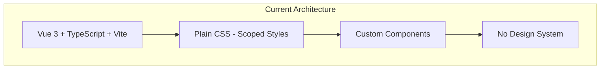
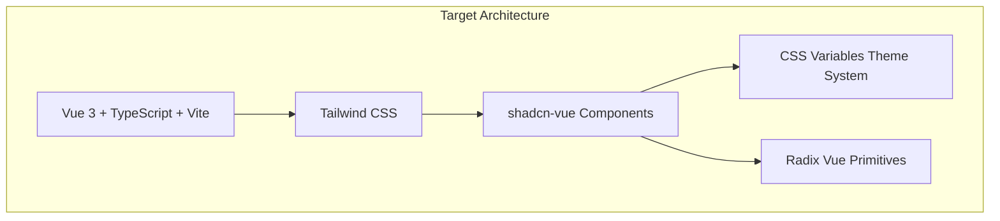

# shadcn-vue Migration Architecture Document

## Executive Summary

This document outlines the comprehensive migration strategy for converting the Breakfast Counter System frontend from plain CSS to shadcn-vue with Tailwind CSS. The migration will adopt the **new-york** style variant with the default theme, maintaining full customization capability for future enhancements.

---

## Table of Contents

1. [Architecture Overview](#architecture-overview)
2. [Technology Stack](#technology-stack)
3. [Setup Requirements](#setup-requirements)
4. [Folder Structure](#folder-structure)
5. [Theme Configuration](#theme-configuration)
6. [Component Inventory](#component-inventory)
7. [Screen-by-Screen Migration Plan](#screen-by-screen-migration-plan)
8. [Phase-by-Phase Implementation](#phase-by-phase-implementation)
9. [Breaking Changes and Considerations](#breaking-changes-and-considerations)
10. [Migration Checklist](#migration-checklist)

---

## Architecture Overview

### Current State



### Target State



### Migration Flow

```mermaid
flowchart LR
    subgraph Phase 1 - Foundation
        A1[Install Dependencies]
        A2[Configure Tailwind]
        A3[Setup shadcn-vue]
        A4[Define Theme Variables]
    end
    
    subgraph Phase 2 - Core Components
        B1[Button]
        B2[Input]
        B3[Card]
        B4[Badge]
    end
    
    subgraph Phase 3 - Layouts
        C1[AuthLayout]
        C2[AdminLayout]
        C3[ScannerLayout]
    end
    
    subgraph Phase 4 - Views
        D1[Login]
        D2[Dashboard]
        D3[Employees]
        D4[Scanners]
        D5[Reports]
        D6[Scan Mode]
    end
    
    A1 --> A2 --> A3 --> A4
    A4 --> B1 --> B2 --> B3 --> B4
    B4 --> C1 --> C2 --> C3
    C3 --> D1 --> D2 --> D3 --> D4 --> D5 --> D6
```



---

## Technology Stack

### Dependencies to Add

```json
{
  "dependencies": {
    "radix-vue": "^1.9.0",
    "class-variance-authority": "^0.7.0",
    "clsx": "^2.1.0",
    "tailwind-merge": "^2.2.0",
    "lucide-vue-next": "^0.344.0"
  },
  "devDependencies": {
    "tailwindcss": "^3.4.1",
    "autoprefixer": "^10.4.17",
    "postcss": "^8.4.35",
    "tailwindcss-animate": "^1.0.7"
  }
}
```

### Version Compatibility Matrix

| Package | Version | Purpose |
|---------|---------|---------|
| Vue | ^3.5.x | Framework |
| TypeScript | ~5.9.x | Type Safety |
| Vite | ^7.x | Build Tool |
| Tailwind CSS | ^3.4.x | Utility CSS |
| radix-vue | ^1.9.x | Accessible Primitives |
| shadcn-vue | latest | Component Library |

---

## Setup Requirements

### 1. Install Tailwind CSS

```bash
npm install -D tailwindcss postcss autoprefixer tailwindcss-animate
npx tailwindcss init -p
```

### 2. Install shadcn-vue Dependencies

```bash
npm install radix-vue class-variance-authority clsx tailwind-merge lucide-vue-next
```

### 3. Initialize shadcn-vue

```bash
npx shadcn-vue@latest init
```

Configuration options:
- **Style**: new-york
- **Base color**: slate
- **CSS variables**: yes
- **Components path**: src/components/ui
- **Utils path**: src/lib/utils

### 4. Configuration Files

#### tailwind.config.js

```javascript
const animate = require("tailwindcss-animate")

/** @type {import('tailwindcss').Config} */
module.exports = {
  darkMode: ["class"],
  safelist: ["dark"],
  prefix: "",
  
  content: [
    './pages/**/*.{ts,tsx,vue}',
    './components/**/*.{ts,tsx,vue}',
    './app/**/*.{ts,tsx,vue}',
    './src/**/*.{ts,tsx,vue}',
  ],
  
  theme: {
    container: {
      center: true,
      padding: "2rem",
      screens: {
        "2xl": "1400px",
      },
    },
    extend: {
      colors: {
        border: "hsl(var(--border))",
        input: "hsl(var(--input))",
        ring: "hsl(var(--ring))",
        background: "hsl(var(--background))",
        foreground: "hsl(var(--foreground))",
        primary: {
          DEFAULT: "hsl(var(--primary))",
          foreground: "hsl(var(--primary-foreground))",
        },
        secondary: {
          DEFAULT: "hsl(var(--secondary))",
          foreground: "hsl(var(--secondary-foreground))",
        },
        destructive: {
          DEFAULT: "hsl(var(--destructive))",
          foreground: "hsl(var(--destructive-foreground))",
        },
        muted: {
          DEFAULT: "hsl(var(--muted))",
          foreground: "hsl(var(--muted-foreground))",
        },
        accent: {
          DEFAULT: "hsl(var(--accent))",
          foreground: "hsl(var(--accent-foreground))",
        },
        popover: {
          DEFAULT: "hsl(var(--popover))",
          foreground: "hsl(var(--popover-foreground))",
        },
        card: {
          DEFAULT: "hsl(var(--card))",
          foreground: "hsl(var(--card-foreground))",
        },
      },
      borderRadius: {
        xl: "calc(var(--radius) + 4px)",
        lg: "var(--radius)",
        md: "calc(var(--radius) - 2px)",
        sm: "calc(var(--radius) - 4px)",
      },
      keyframes: {
        "accordion-down": {
          from: { height: 0 },
          to: { height: "var(--radix-accordion-content-height)" },
        },
        "accordion-up": {
          from: { height: "var(--radix-accordion-content-height)" },
          to: { height: 0 },
        },
        "collapsible-down": {
          from: { height: 0 },
          to: { height: 'var(--radix-collapsible-content-height)' },
        },
        "collapsible-up": {
          from: { height: 'var(--radix-collapsible-content-height)' },
          to: { height: 0 },
        },
      },
      animation: {
        "accordion-down": "accordion-down 0.2s ease-out",
        "accordion-up": "accordion-up 0.2s ease-out",
        "collapsible-down": "collapsible-down 0.2s ease-in-out",
        "collapsible-up": "collapsible-up 0.2s ease-in-out",
      },
    },
  },
  plugins: [animate],
}
```

#### components.json

```json
{
  "$schema": "https://shadcn-vue.com/schema.json",
  "style": "new-york",
  "typescript": true,
  "tailwind": {
    "config": "tailwind.config.js",
    "css": "src/assets/index.css",
    "baseColor": "slate",
    "cssVariables": true,
    "prefix": ""
  },
  "framework": "vite",
  "aliases": {
    "components": "@/components",
    "utils": "@/lib/utils",
    "ui": "@/components/ui",
    "lib": "@/lib",
    "hooks": "@/composables"
  }
}
```

---

## Folder Structure

### Target Directory Structure

```
src/
├── assets/
│   └── index.css              # Global styles with CSS variables
├── components/
│   ├── ui/                    # shadcn-vue components
│   │   ├── alert/
│   │   │   ├── Alert.vue
│   │   │   ├── AlertDescription.vue
│   │   │   ├── AlertTitle.vue
│   │   │   └── index.ts
│   │   ├── badge/
│   │   │   ├── Badge.vue
│   │   │   └── index.ts
│   │   ├── button/
│   │   │   ├── Button.vue
│   │   │   └── index.ts
│   │   ├── card/
│   │   │   ├── Card.vue
│   │   │   ├── CardContent.vue
│   │   │   ├── CardDescription.vue
│   │   │   ├── CardFooter.vue
│   │   │   ├── CardHeader.vue
│   │   │   ├── CardTitle.vue
│   │   │   └── index.ts
│   │   ├── checkbox/
│   │   ├── dialog/
│   │   ├── dropdown-menu/
│   │   ├── form/
│   │   ├── input/
│   │   ├── label/
│   │   ├── navigation-menu/
│   │   ├── select/
│   │   ├── separator/
│   │   ├── skeleton/
│   │   ├── table/
│   │   ├── tabs/
│   │   └── toast/
│   ├── common/                # Shared business components
│   │   ├── AppHeader.vue
│   │   ├── AppSidebar.vue
│   │   └── LoadingSpinner.vue
│   ├── employee/              # Employee-specific components
│   ├── scanner/               # Scanner-specific components
│   └── BulkUploadModal.vue    # Refactored with Dialog
├── layouts/
│   ├── AdminLayout.vue
│   ├── AuthLayout.vue
│   └── ScannerLayout.vue
├── lib/
│   └── utils.ts               # cn() utility function
└── views/
    └── ...
```

### Utils File (src/lib/utils.ts)

```typescript
import { type ClassValue, clsx } from 'clsx'
import { twMerge } from 'tailwind-merge'

export function cn(...inputs: ClassValue[]) {
  return twMerge(clsx(inputs))
}
```

---

## Theme Configuration

### CSS Variables (src/assets/index.css)

```css
@tailwind base;
@tailwind components;
@tailwind utilities;

@layer base {
  :root {
    --background: 0 0% 100%;
    --foreground: 222.2 84% 4.9%;
    --card: 0 0% 100%;
    --card-foreground: 222.2 84% 4.9%;
    --popover: 0 0% 100%;
    --popover-foreground: 222.2 84% 4.9%;
    --primary: 222.2 47.4% 11.2%;
    --primary-foreground: 210 40% 98%;
    --secondary: 210 40% 96.1%;
    --secondary-foreground: 222.2 47.4% 11.2%;
    --muted: 210 40% 96.1%;
    --muted-foreground: 215.4 16.3% 46.9%;
    --accent: 210 40% 96.1%;
    --accent-foreground: 222.2 47.4% 11.2%;
    --destructive: 0 84.2% 60.2%;
    --destructive-foreground: 210 40% 98%;
    --border: 214.3 31.8% 91.4%;
    --input: 214.3 31.8% 91.4%;
    --ring: 222.2 84% 4.9%;
    --radius: 0.5rem;
    
    /* Custom brand colors for Breakfast Counter */
    --brand-primary: 234 89% 74%;        /* #667eea equivalent */
    --brand-secondary: 271 81% 56%;      /* #764ba2 equivalent */
    --success: 142 76% 36%;
    --warning: 38 92% 50%;
  }

  .dark {
    --background: 222.2 84% 4.9%;
    --foreground: 210 40% 98%;
    --card: 222.2 84% 4.9%;
    --card-foreground: 210 40% 98%;
    --popover: 222.2 84% 4.9%;
    --popover-foreground: 210 40% 98%;
    --primary: 210 40% 98%;
    --primary-foreground: 222.2 47.4% 11.2%;
    --secondary: 217.2 32.6% 17.5%;
    --secondary-foreground: 210 40% 98%;
    --muted: 217.2 32.6% 17.5%;
    --muted-foreground: 215 20.2% 65.1%;
    --accent: 217.2 32.6% 17.5%;
    --accent-foreground: 210 40% 98%;
    --destructive: 0 62.8% 30.6%;
    --destructive-foreground: 210 40% 98%;
    --border: 217.2 32.6% 17.5%;
    --input: 217.2 32.6% 17.5%;
    --ring: 212.7 26.8% 83.9%;
  }
}

@layer base {
  * {
    @apply border-border;
  }
  body {
    @apply bg-background text-foreground;
  }
}
```

### Theme Customization Guide

To customize the theme for the Breakfast Counter brand:

1. **Primary Brand Color** (#667eea):
   ```css
   --primary: 234 89% 74%;
   ```

2. **Gradient Background** (for auth pages):
   ```css
   .auth-gradient {
     @apply bg-gradient-to-br from-[hsl(var(--brand-primary))] to-[hsl(var(--brand-secondary))];
   }
   ```

3. **Status Colors**:
   ```css
   --success: 142 76% 36%;    /* Green for active/success */
   --warning: 38 92% 50%;     /* Orange for warnings */
   --destructive: 0 84% 60%;  /* Red for errors/inactive */
   ```

---

## Component Inventory

### shadcn-vue Components Required

| Component | Usage | Priority |
|-----------|-------|----------|
| **Button** | All forms, actions, navigation | High |
| **Input** | Login, employee forms, search | High |
| **Card** | Dashboard stats, employee cards | High |
| **Badge** | Status indicators, department tags | High |
| **Table** | Employee list, scanner list, history | High |
| **Dialog** | Bulk upload modal, confirmations | High |
| **Select** | Department filter, status filter | High |
| **Label** | Form labels | High |
| **Form** | Form validation wrapper | High |
| **Checkbox** | Active status toggle | Medium |
| **Alert** | Error messages, notifications | Medium |
| **Skeleton** | Loading states | Medium |
| **Separator** | Visual dividers | Medium |
| **Navigation Menu** | Admin navigation | Medium |
| **Dropdown Menu** | Action menus | Medium |
| **Tabs** | Reports view tabs | Low |
| **Toast** | Notifications (replace uiStore) | Low |
| **Avatar** | User display | Low |

### Component Installation Commands

```bash
# High Priority - Phase 2
npx shadcn-vue@latest add button
npx shadcn-vue@latest add input
npx shadcn-vue@latest add card
npx shadcn-vue@latest add badge
npx shadcn-vue@latest add table
npx shadcn-vue@latest add dialog
npx shadcn-vue@latest add select
npx shadcn-vue@latest add label
npx shadcn-vue@latest add form

# Medium Priority - Phase 3
npx shadcn-vue@latest add checkbox
npx shadcn-vue@latest add alert
npx shadcn-vue@latest add skeleton
npx shadcn-vue@latest add separator
npx shadcn-vue@latest add navigation-menu
npx shadcn-vue@latest add dropdown-menu

# Low Priority - Phase 4
npx shadcn-vue@latest add tabs
npx shadcn-vue@latest add toast
npx shadcn-vue@latest add avatar
```

---

## Screen-by-Screen Migration Plan

### 1. Login View (src/views/auth/LoginView.vue)

#### Current Components
- Custom `.login-card` container
- Custom `.form-group` with label/input
- Custom `.btn-login` button
- Custom `.error-message` alert

#### shadcn-vue Mapping

| Current | shadcn-vue | Notes |
|---------|------------|-------|
| `.login-card` | `Card`, `CardHeader`, `CardContent` | Use Card component |
| `.form-group` | `FormField`, `FormItem`, `FormLabel`, `FormControl` | Use Form components |
| `input` | `Input` | Direct replacement |
| `.btn-login` | `Button` | Use default variant |
| `.error-message` | `Alert` with `AlertDescription` | Use destructive variant |

#### Target Structure

```vue
<template>
  <div class="min-h-screen flex items-center justify-center bg-gradient-to-br from-[hsl(234,89%,74%)] to-[hsl(271,81%,56%)] p-5">
    <Card class="w-full max-w-[420px] shadow-2xl">
      <CardHeader class="text-center">
        <CardTitle class="text-2xl">Breakfast Counter System</CardTitle>
        <CardDescription>QR-Based Attendance Tracking</CardDescription>
      </CardHeader>
      <CardContent>
        <form @submit.prevent="handleLogin" class="space-y-6">
          <FormField name="username">
            <FormItem>
              <FormLabel>Username</FormLabel>
              <FormControl>
                <Input v-model="username" placeholder="Enter your username" :disabled="isLoading" />
              </FormControl>
            </FormItem>
          </FormField>
          
          <FormField name="password">
            <FormItem>
              <FormLabel>Password</FormLabel>
              <FormControl>
                <Input v-model="password" type="password" placeholder="Enter your password" :disabled="isLoading" />
              </FormControl>
            </FormItem>
          </FormField>
          
          <Alert v-if="error" variant="destructive">
            <AlertDescription>{{ error }}</AlertDescription>
          </Alert>
          
          <Button type="submit" class="w-full" :disabled="isLoading">
            {{ isLoading ? 'Logging in...' : 'Login' }}
          </Button>
        </form>
        
        <Alert class="mt-6" variant="default">
          <AlertDescription>
            <strong>Note:</strong> This is an internal system. Please use your assigned credentials.
          </AlertDescription>
        </Alert>
      </CardContent>
    </Card>
  </div>
</template>
```

---

### 2. Dashboard View (src/views/admin/DashboardView.vue)

#### Current Components
- Custom `.stats-grid` layout
- Custom `.stat-card` cards

#### shadcn-vue Mapping

| Current | shadcn-vue | Notes |
|---------|------------|-------|
| `.stats-grid` | Tailwind grid classes | `grid grid-cols-1 md:grid-cols-2 lg:grid-cols-4 gap-6` |
| `.stat-card` | `Card`, `CardHeader`, `CardTitle`, `CardContent` | Use Card component |

#### Target Structure

```vue
<template>
  <div class="p-8">
    <div class="mb-8">
      <h1 class="text-3xl font-bold tracking-tight">Admin Dashboard</h1>
      <p class="text-muted-foreground">Welcome to the Breakfast Counter System Admin Panel</p>
    </div>
    
    <div class="grid grid-cols-1 md:grid-cols-2 lg:grid-cols-4 gap-6">
      <Card>
        <CardHeader class="pb-2">
          <CardTitle class="text-sm font-medium text-muted-foreground">Total Employees</CardTitle>
        </CardHeader>
        <CardContent>
          <div class="text-3xl font-bold">-</div>
        </CardContent>
      </Card>
      <!-- Repeat for other stats -->
    </div>
  </div>
</template>
```

---

### 3. Employees View (src/views/admin/EmployeesView.vue)

#### Current Components
- Custom header with actions
- Custom filter card with search/select
- Custom data table
- Custom badges for status/department
- Custom action buttons

#### shadcn-vue Mapping

| Current | shadcn-vue | Notes |
|---------|------------|-------|
| `.header` | Tailwind flex layout | `flex justify-between items-center` |
| `.btn-create`, `.btn-bulk` | `Button` | Use variants: default, secondary |
| `.filters-card` | `Card` | Wrap filters in Card |
| `.search-input` | `Input` | With search icon |
| `.filter-select` | `Select`, `SelectTrigger`, `SelectContent`, `SelectItem` | Full Select component |
| `.employees-table` | `Table`, `TableHeader`, `TableBody`, `TableRow`, `TableCell` | Full Table component |
| `.department-badge` | `Badge` | Use secondary variant |
| `.status-badge` | `Badge` | Use success/destructive variants |
| `.btn-action` | `Button` | Use ghost variant with icon |
| `.empty-state` | Custom with `Skeleton` | Loading state |

#### Target Structure

```vue
<template>
  <div class="p-8 space-y-6">
    <!-- Header -->
    <div class="flex justify-between items-center">
      <h1 class="text-3xl font-bold tracking-tight">Employees</h1>
      <div class="flex gap-3">
        <Button variant="secondary" @click="showBulkUpload = true">
          <Upload class="w-4 h-4 mr-2" />
          Bulk Upload
        </Button>
        <Button @click="createEmployee">
          <Plus class="w-4 h-4 mr-2" />
          Add Employee
        </Button>
      </div>
    </div>

    <!-- Filters -->
    <Card>
      <CardContent class="pt-6">
        <div class="grid grid-cols-1 md:grid-cols-3 gap-4 mb-4">
          <div class="relative">
            <Search class="absolute left-3 top-3 h-4 w-4 text-muted-foreground" />
            <Input v-model="searchQuery" placeholder="Search..." class="pl-10" />
          </div>
          <Select v-model="selectedDepartment">
            <SelectTrigger>
              <SelectValue placeholder="All Departments" />
            </SelectTrigger>
            <SelectContent>
              <SelectItem value="">All Departments</SelectItem>
              <SelectItem v-for="dept in DEPARTMENTS" :key="dept" :value="dept">
                {{ dept }}
              </SelectItem>
            </SelectContent>
          </Select>
          <Select v-model="statusFilter">
            <SelectTrigger>
              <SelectValue placeholder="All Status" />
            </SelectTrigger>
            <SelectContent>
              <SelectItem value="all">All Status</SelectItem>
              <SelectItem value="active">Active Only</SelectItem>
              <SelectItem value="inactive">Inactive Only</SelectItem>
            </SelectContent>
          </Select>
        </div>
        <p class="text-sm text-muted-foreground">
          {{ filteredEmployees.length }} employee{{ filteredEmployees.length !== 1 ? 's' : '' }}
        </p>
      </CardContent>
    </Card>

    <!-- Table -->
    <Card>
      <Table>
        <TableHeader>
          <TableRow>
            <TableHead>Name</TableHead>
            <TableHead>Phone</TableHead>
            <TableHead>Employee ID</TableHead>
            <TableHead>Email</TableHead>
            <TableHead>Department</TableHead>
            <TableHead>Status</TableHead>
            <TableHead class="text-right">Actions</TableHead>
          </TableRow>
        </TableHeader>
        <TableBody>
          <TableRow v-for="employee in filteredEmployees" :key="employee.phone">
            <TableCell class="font-medium">{{ employee.name }}</TableCell>
            <TableCell class="font-mono">{{ employee.phone }}</TableCell>
            <TableCell>{{ employee.employee_id }}</TableCell>
            <TableCell>{{ employee.email }}</TableCell>
            <TableCell>
              <Badge variant="secondary">{{ employee.department }}</Badge>
            </TableCell>
            <TableCell>
              <Badge :variant="employee.is_active ? 'default' : 'destructive'">
                {{ employee.is_active ? 'Active' : 'Inactive' }}
              </Badge>
            </TableCell>
            <TableCell class="text-right">
              <DropdownMenu>
                <DropdownMenuTrigger asChild>
                  <Button variant="ghost" size="icon">
                    <MoreHorizontal class="h-4 w-4" />
                  </Button>
                </DropdownMenuTrigger>
                <DropdownMenuContent align="end">
                  <DropdownMenuItem @click="viewEmployee(employee.phone)">
                    <Eye class="mr-2 h-4 w-4" /> View
                  </DropdownMenuItem>
                  <DropdownMenuItem @click="editEmployee(employee.phone)">
                    <Pencil class="mr-2 h-4 w-4" /> Edit
                  </DropdownMenuItem>
                  <DropdownMenuItem @click="downloadQR(employee)">
                    <QrCode class="mr-2 h-4 w-4" /> Download QR
                  </DropdownMenuItem>
                  <DropdownMenuSeparator />
                  <DropdownMenuItem @click="toggleStatus(employee)">
                    {{ employee.is_active ? 'Deactivate' : 'Activate' }}
                  </DropdownMenuItem>
                  <DropdownMenuItem class="text-destructive" @click="deleteEmployee(employee)">
                    <Trash class="mr-2 h-4 w-4" /> Delete
                  </DropdownMenuItem>
                </DropdownMenuContent>
              </DropdownMenu>
            </TableCell>
          </TableRow>
        </TableBody>
      </Table>
    </Card>

    <!-- Bulk Upload Dialog -->
    <Dialog v-model:open="showBulkUpload">
      <!-- Dialog content -->
    </Dialog>
  </div>
</template>
```

---

### 4. Employee Create/Edit Views

#### shadcn-vue Mapping

| Current | shadcn-vue | Notes |
|---------|------------|-------|
| `.form-container` | `Card` | Wrap form in Card |
| `.form-group` | `FormField`, `FormItem`, `FormLabel`, `FormControl`, `FormMessage` | Full form validation |
| `input` | `Input` | Direct replacement |
| `select` | `Select` components | Full Select |
| `.checkbox-group` | `Checkbox` with `Label` | Use Checkbox component |
| `.btn-primary`, `.btn-secondary` | `Button` | Use variants |
| `.qr-preview` | `Card` with custom content | Success state card |

---

### 5. Scanners View (src/views/admin/ScannersView.vue)

Similar to Employees View with:
- `Table` for scanner list
- `Badge` for role and status
- `Select` for filters
- `Button` for actions

---

### 6. Scanner Create View (src/views/admin/ScannerCreateView.vue)

Similar to Employee Create with:
- `Card` for form container
- `Form` components for validation
- `Input` for username/password
- `Select` for role selection
- `Button` for actions

---

### 7. Reports View (src/views/admin/ReportsView.vue)

#### shadcn-vue Components
- `Tabs`, `TabsList`, `TabsTrigger`, `TabsContent` for report sections
- `Card` for report containers
- `Table` for data display
- `Select` for date range filters
- `Button` for export actions

---

### 8. Scan View (src/views/scanner/ScanView.vue)

#### shadcn-vue Mapping

| Current | shadcn-vue | Notes |
|---------|------------|-------|
| `.camera-wrapper` | `Card` | Camera container |
| `.btn-toggle` | `Button` | Use success/destructive variants |
| `.scan-result` | `Alert` | Success/error variants |
| `.scan-stats` | `Card` with grid | Stats display |
| `.stat-card` | `Card` | Individual stat cards |

---

### 9. Scan History View (src/views/scanner/ScanHistoryView.vue)

#### shadcn-vue Mapping

| Current | shadcn-vue | Notes |
|---------|------------|-------|
| `.filters-card` | `Card` | Filter container |
| `.date-input` | `Input` type="date" or DatePicker | Date selection |
| `.status-select` | `Select` | Status filter |
| `.stats-summary` | Grid of `Card` | Stats display |
| `.history-list` | Custom list or `Table` | History items |
| `.status-badge` | `Badge` | Status indicators |

---

### 10. Layouts Migration

#### AdminLayout.vue

```vue
<template>
  <div class="min-h-screen bg-background">
    <!-- Header -->
    <header class="sticky top-0 z-50 w-full border-b bg-background/95 backdrop-blur">
      <div class="container flex h-16 items-center justify-between">
        <h1 class="text-xl font-semibold">Breakfast Counter System - Admin</h1>
        <div class="flex items-center gap-4">
          <span class="text-sm text-muted-foreground">Welcome, {{ authStore.username }}</span>
          <Button variant="destructive" size="sm" @click="handleLogout">
            <LogOut class="w-4 h-4 mr-2" />
            Logout
          </Button>
        </div>
      </div>
    </header>

    <!-- Navigation -->
    <nav class="border-b bg-primary">
      <div class="container">
        <NavigationMenu>
          <NavigationMenuList>
            <NavigationMenuItem>
              <NavigationMenuLink asChild>
                <RouterLink to="/admin" class="nav-link">Dashboard</RouterLink>
              </NavigationMenuLink>
            </NavigationMenuItem>
            <!-- More nav items -->
          </NavigationMenuList>
        </NavigationMenu>
      </div>
    </nav>

    <!-- Main Content -->
    <main class="container py-6">
      <RouterView />
    </main>
  </div>
</template>
```

#### AuthLayout.vue

```vue
<template>
  <div class="min-h-screen flex items-center justify-center bg-gradient-to-br from-[hsl(234,89%,74%)] to-[hsl(271,81%,56%)]">
    <RouterView />
  </div>
</template>
```

#### ScannerLayout.vue

```vue
<template>
  <div class="min-h-screen bg-slate-900 text-white">
    <header class="sticky top-0 z-50 w-full border-b border-slate-700 bg-slate-800/95 backdrop-blur">
      <div class="container flex h-16 items-center justify-between">
        <h1 class="text-xl font-semibold">QR Code Scanner</h1>
        <div class="flex items-center gap-4">
          <span class="text-sm text-slate-400">{{ authStore.username }}</span>
          <Button variant="destructive" size="sm" @click="handleLogout">
            Logout
          </Button>
        </div>
      </div>
    </header>
    <main class="py-6">
      <RouterView />
    </main>
  </div>
</template>
```

---

### 11. BulkUploadModal Migration

Convert to use `Dialog` component:

```vue
<template>
  <Dialog v-model:open="isOpen">
    <DialogContent class="max-w-2xl">
      <DialogHeader>
        <DialogTitle>Bulk Upload Employees</DialogTitle>
        <DialogDescription>
          Upload a CSV file to add multiple employees at once.
        </DialogDescription>
      </DialogHeader>
      
      <div v-if="!showResults" class="space-y-6">
        <!-- Instructions -->
        <Alert>
          <AlertTitle>Instructions</AlertTitle>
          <AlertDescription>
            <ol class="list-decimal list-inside space-y-1 mt-2">
              <li>Download the CSV template</li>
              <li>Fill in employee details</li>
              <li>Upload the completed file</li>
            </ol>
          </AlertDescription>
        </Alert>

        <Button variant="secondary" class="w-full" @click="downloadTemplate">
          <Download class="w-4 h-4 mr-2" />
          Download Template
        </Button>

        <!-- File Upload Area -->
        <div 
          class="border-2 border-dashed rounded-lg p-8 text-center cursor-pointer hover:border-primary transition-colors"
          @click="selectFile"
        >
          <!-- Upload content -->
        </div>
      </div>

      <div v-else class="space-y-6">
        <!-- Results -->
        <div class="grid grid-cols-3 gap-4">
          <Card class="border-l-4 border-l-green-500">
            <CardContent class="pt-6 text-center">
              <div class="text-3xl font-bold">{{ uploadResults.successful }}</div>
              <div class="text-sm text-muted-foreground">Successful</div>
            </CardContent>
          </Card>
          <!-- More result cards -->
        </div>
      </div>

      <DialogFooter>
        <Button variant="secondary" @click="close">Cancel</Button>
        <Button @click="uploadFile" :disabled="!selectedFile || isUploading">
          {{ isUploading ? 'Uploading...' : 'Upload Employees' }}
        </Button>
      </DialogFooter>
    </DialogContent>
  </Dialog>
</template>
```

---

## Phase-by-Phase Implementation

### Phase 1: Foundation Setup

**Objective**: Set up Tailwind CSS and shadcn-vue infrastructure

**Tasks**:
1. Install Tailwind CSS and configure `tailwind.config.js`
2. Install shadcn-vue dependencies
3. Initialize shadcn-vue with new-york style
4. Create `src/lib/utils.ts` with `cn()` function
5. Create `src/assets/index.css` with CSS variables
6. Update `vite.config.ts` for path aliases
7. Update `main.ts` to import new styles
8. Remove old `src/style.css` content (keep file for transition)

**Deliverables**:
- Working Tailwind CSS setup
- shadcn-vue initialized
- Theme variables defined
- Build passing

---

### Phase 2: Core Components Installation

**Objective**: Install and verify all required shadcn-vue components

**Tasks**:
1. Install high-priority components:
   - Button, Input, Card, Badge, Table, Dialog, Select, Label, Form
2. Install medium-priority components:
   - Checkbox, Alert, Skeleton, Separator, Navigation Menu, Dropdown Menu
3. Install low-priority components:
   - Tabs, Toast, Avatar
4. Verify all components render correctly
5. Create component index files for easy imports

**Deliverables**:
- All components installed in `src/components/ui/`
- Components verified working
- Import structure established

---

### Phase 3: Layout Migration

**Objective**: Migrate all layout components to shadcn-vue

**Tasks**:
1. Migrate `AuthLayout.vue`
   - Replace CSS with Tailwind classes
   - Maintain gradient background
2. Migrate `AdminLayout.vue`
   - Replace header with shadcn-vue components
   - Replace navigation with NavigationMenu
   - Update container styles
3. Migrate `ScannerLayout.vue`
   - Apply dark theme classes
   - Replace header components

**Deliverables**:
- All layouts using Tailwind CSS
- Navigation working correctly
- Responsive design maintained

---

### Phase 4: View Migration - Authentication

**Objective**: Migrate login and auth-related views

**Tasks**:
1. Migrate `LoginView.vue`
   - Replace with Card, Form, Input, Button, Alert
   - Maintain form validation
   - Test login flow
2. Update `UnauthorizedView.vue`
   - Apply consistent styling

**Deliverables**:
- Login page fully migrated
- Authentication flow working
- Error handling maintained

---

### Phase 5: View Migration - Dashboard

**Objective**: Migrate dashboard view

**Tasks**:
1. Migrate `DashboardView.vue`
   - Replace stat cards with Card components
   - Apply grid layout with Tailwind
   - Add loading states with Skeleton

**Deliverables**:
- Dashboard fully migrated
- Stats displaying correctly
- Loading states implemented

---

### Phase 6: View Migration - Employees

**Objective**: Migrate all employee-related views

**Tasks**:
1. Migrate `EmployeesView.vue`
   - Replace filters with Card, Input, Select
   - Replace table with Table components
   - Replace badges with Badge component
   - Replace actions with DropdownMenu
   - Migrate BulkUploadModal to Dialog
2. Migrate `EmployeeCreateView.vue`
   - Replace form with Form components
   - Add proper validation messages
   - Update QR preview section
3. Migrate `EmployeeEditView.vue`
   - Similar to create view
4. Migrate `EmployeeDetailView.vue`
   - Design and implement detail view

**Deliverables**:
- All employee views migrated
- CRUD operations working
- Bulk upload working
- QR code generation working

---

### Phase 7: View Migration - Scanners

**Objective**: Migrate scanner management views

**Tasks**:
1. Migrate `ScannersView.vue`
   - Similar structure to EmployeesView
   - Replace table and filters
2. Migrate `ScannerCreateView.vue`
   - Replace form components
   - Maintain password validation

**Deliverables**:
- Scanner views migrated
- Scanner CRUD working

---

### Phase 8: Update Layouts and Common Components ✅ COMPLETED

**Objective**: Convert remaining layouts and common components from plain CSS to shadcn-vue components

**Tasks Completed**:
1. ✅ Reviewed and updated ScannerLayout.vue - Already using shadcn-vue components
2. ✅ Reviewed and updated AuthLayout.vue - Already using shadcn-vue components
3. ✅ Reviewed and updated AdminLayout.vue - Already using shadcn-vue components
4. ✅ Converted BulkUploadModal.vue to use Dialog, Form, Button, Input, Select, Alert, and Skeleton components
5. ✅ Updated App.vue with Toaster component for global toast notifications
6. ✅ Updated main.ts to ensure Toaster is properly registered
7. ✅ Verified all layouts use shadcn-vue components consistently
8. ✅ Removed all scoped CSS from converted components
9. ✅ Ensured responsive design across all layouts

**Deliverables**:
- ✅ All layouts using shadcn-vue components
- ✅ BulkUploadModal fully converted to shadcn-vue
- ✅ App.vue updated with Toaster
- ✅ main.ts properly configured
- ✅ No remaining plain CSS in layouts
- ✅ Responsive design maintained

---

### Phase 9: View Migration - Scanner Mode

**Objective**: Migrate scanner operation views

**Tasks**:
1. Migrate `ScanView.vue`
   - Maintain camera functionality
   - Replace result display with Alert
   - Update stats cards
2. Migrate `ScanHistoryView.vue`
   - Replace filters and table
   - Update status badges

**Deliverables**:
- Scanner mode fully working
- Camera integration maintained
- History display working

---

### Phase 10: Cleanup and Polish

**Objective**: Final cleanup and optimization

**Tasks**:
1. Remove all old CSS files and scoped styles
2. Audit for any remaining plain CSS
3. Test all responsive breakpoints
4. Test dark mode (if applicable)
5. Performance optimization
6. Update documentation

**Deliverables**:
- Clean codebase
- No legacy CSS
- Full test coverage
- Updated documentation

---

## Breaking Changes and Considerations

### 1. CSS Specificity Changes

**Issue**: Tailwind's utility classes may conflict with any remaining global styles.

**Solution**: 
- Remove all scoped `<style>` blocks after migration
- Use `@apply` sparingly, prefer utility classes
- Use `cn()` for conditional classes

### 2. Form Validation

**Issue**: Current validation is manual; shadcn-vue forms use vee-validate or similar.

**Solution**:
- Option A: Keep manual validation, just update styling
- Option B: Integrate vee-validate with Form components
- Recommendation: Start with Option A, migrate to B later

### 3. Toast Notifications

**Issue**: Current `uiStore.showSuccess/showError` uses custom implementation.

**Solution**:
- Option A: Keep uiStore, update styling
- Option B: Migrate to shadcn-vue Toast component
- Recommendation: Migrate to Toast for consistency

### 4. Icon Migration

**Issue**: Current icons use emoji characters.

**Solution**:
- Replace all emoji icons with Lucide icons
- Install `lucide-vue-next`
- Create consistent icon usage patterns

### 5. Color Scheme

**Issue**: Current brand color (#667eea) needs to be preserved.

**Solution**:
- Define custom CSS variables for brand colors
- Use `hsl()` format for consistency
- Create utility classes for brand gradients

### 6. Dark Mode

**Issue**: Scanner layout uses dark theme, others use light.

**Solution**:
- Use `.dark` class on ScannerLayout
- Ensure all components support dark mode
- Test contrast ratios

### 7. Responsive Design

**Issue**: Current responsive breakpoints may differ from Tailwind defaults.

**Solution**:
- Audit all responsive styles
- Map to Tailwind breakpoints (sm, md, lg, xl, 2xl)
- Test on multiple devices

### 8. Animation and Transitions

**Issue**: Current CSS transitions need to be migrated.

**Solution**:
- Use Tailwind transition utilities
- Use `tailwindcss-animate` for complex animations
- Maintain Vue transition components

---

## Migration Checklist

### Pre-Migration

- [ ] Backup current codebase
- [ ] Create migration branch
- [ ] Document current functionality
- [ ] Set up testing environment

### Phase 1: Foundation

- [ ] Install Tailwind CSS
- [ ] Configure `tailwind.config.js`
- [ ] Install shadcn-vue dependencies
- [ ] Initialize shadcn-vue
- [ ] Create `src/lib/utils.ts`
- [ ] Create `src/assets/index.css`
- [ ] Update `vite.config.ts`
- [ ] Update `main.ts`
- [ ] Verify build passes

### Phase 2: Components

- [ ] Install Button component
- [ ] Install Input component
- [ ] Install Card component
- [ ] Install Badge component
- [ ] Install Table component
- [ ] Install Dialog component
- [ ] Install Select component
- [ ] Install Label component
- [ ] Install Form component
- [ ] Install Checkbox component
- [ ] Install Alert component
- [ ] Install Skeleton component
- [ ] Install Separator component
- [ ] Install Navigation Menu component
- [ ] Install Dropdown Menu component
- [ ] Install Tabs component
- [ ] Install Toast component
- [ ] Verify all components work

### Phase 3: Layouts

- [ ] Migrate AuthLayout.vue
- [ ] Migrate AdminLayout.vue
- [ ] Migrate ScannerLayout.vue
- [ ] Test navigation
- [ ] Test responsive design

### Phase 4: Login

- [ ] Migrate LoginView.vue
- [ ] Test login flow
- [ ] Test error handling
- [ ] Update UnauthorizedView.vue

### Phase 5: Dashboard

- [ ] Migrate DashboardView.vue
- [ ] Add loading states
- [ ] Test stats display

### Phase 6: Employees

- [ ] Migrate EmployeesView.vue
- [ ] Migrate filters
- [ ] Migrate table
- [ ] Migrate action buttons
- [ ] Migrate BulkUploadModal
- [ ] Migrate EmployeeCreateView.vue
- [ ] Migrate EmployeeEditView.vue
- [ ] Migrate EmployeeDetailView.vue
- [ ] Test CRUD operations
- [ ] Test bulk upload
- [ ] Test QR code generation

### Phase 7: Scanners

- [ ] Migrate ScannersView.vue
- [ ] Migrate ScannerCreateView.vue
- [ ] Test scanner CRUD

### Phase 8: Reports

- [ ] Migrate ReportsView.vue
- [ ] Implement tabs
- [ ] Test filtering

### Phase 9: Scanner Mode

- [ ] Migrate ScanView.vue
- [ ] Test camera functionality
- [ ] Migrate ScanHistoryView.vue
- [ ] Test history display

### Phase 10: Cleanup

- [ ] Remove all scoped styles
- [ ] Remove old CSS files
- [ ] Audit for remaining plain CSS
- [ ] Test all responsive breakpoints
- [ ] Test dark mode
- [ ] Performance audit
- [ ] Update documentation
- [ ] Code review
- [ ] Merge to main

### Post-Migration

- [ ] Deploy to staging
- [ ] User acceptance testing
- [ ] Deploy to production
- [ ] Monitor for issues

---

## Appendix

### A. Lucide Icons Reference

Common icons used in the application:

```typescript
import {
  Plus,
  Upload,
  Download,
  Search,
  Eye,
  Pencil,
  Trash,
  QrCode,
  MoreHorizontal,
  LogOut,
  Check,
  X,
  AlertCircle,
  Info,
  ChevronDown,
  ChevronRight,
  User,
  Users,
  Settings,
  BarChart,
  Calendar,
  Clock,
  Scan
} from 'lucide-vue-next'
```

### B. Common Tailwind Patterns

```html
<!-- Card with shadow -->
<div class="rounded-lg border bg-card text-card-foreground shadow-sm">

<!-- Flex header -->
<div class="flex items-center justify-between">

<!-- Grid layout -->
<div class="grid grid-cols-1 md:grid-cols-2 lg:grid-cols-4 gap-6">

<!-- Form group -->
<div class="space-y-2">

<!-- Button group -->
<div class="flex gap-3">

<!-- Status badge -->
<span class="inline-flex items-center rounded-full px-2.5 py-0.5 text-xs font-semibold">
```

### C. Color Reference

| Color | HSL Value | Usage |
|-------|-----------|-------|
| Brand Primary | 234 89% 74% | Primary actions, links |
| Brand Secondary | 271 81% 56% | Gradients |
| Success | 142 76% 36% | Active status, success messages |
| Warning | 38 92% 50% | Warnings, duplicates |
| Destructive | 0 84% 60% | Errors, delete actions |

---

## Document History

| Version | Date | Author | Changes |
|---------|------|--------|---------|
| 1.0 | 2026-01-13 | Architecture Team | Initial document |

---

*This document serves as the comprehensive guide for migrating the Breakfast Counter System frontend to shadcn-vue. Follow the phases sequentially and check off items as completed.*
